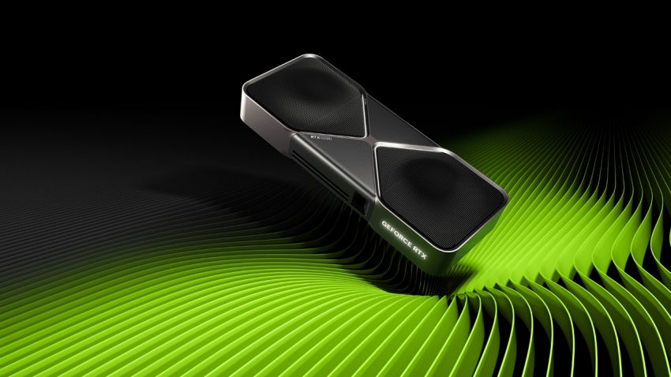

# GPU Memory Cleaner





Free your VRAM!, its frustrating when you are constantly doing any DL, or LLM application and your program crashes and you need to manually find and kill that procees. During this suffering (:O) I thought to make this as a tool open for everyone. Any contribution or suggestion to improve the code is welcome.


## Quick Start

### Method 1: Direct Usage
```bash
# Download the script
wget https://github.com/RhinoCoder/GpuClean   
chmod +x GpumemoryCleaner.py

# Use directly
python GpumemoryCleaner.py --status
python GpumemoryCleaner.py --clear
```

### Method 2: Install as Package
```bash
# Create directory structure
mkdir GpuClean
cd GpuClean

# Copy gpu_cleaner.py and setup.py to this directory
# Then install:
pip install -e .

# Now you can use the command anywhere:
gpu-clean --status
gpu-clean --clear
```

## Usage Examples

### Check GPU Status
```bash
# Show current GPU memory usage and processes
gpu-clean --status
```

Output example:
```
=== GPU A100 Memory Status ===
GPU 0: 2048MB / 24576MB (8.3% used, 22528MB free)

=== GPU A100 Processes ===
PID: 12345    GPU: 0   Memory: 2048MB   Command: python finetune.py
PID: 67890    GPU: 0   Memory: 512MB    Command: python inference.py
```

### Clear All GPU Memory
```bash
# Terminate all GPU processes
gpu-clean --clear

# Force kill (more aggressive)
gpu-clean --clear --force
```

### Target Specific GPUs
```bash
# Clear only GPU 0 and 1
gpu-clean --clear --gpu 0,1
```

### Exclude Specific Processes
```bash
# Clear all except specific PIDs
gpu-clean --clear --exclude 12345,67890
```

### Dry Run (Preview)
```bash
# See what would be terminated without actually doing it
gpu-clean --clear --dry-run
```

### Combine Options
```bash
# Force clear GPU 0, excluding PID 12345, with verbose output
gpu-clean --clear --force --gpu 0 --exclude 12345 --verbose
```

## Command Line Options

- `--status, -s`: Show current GPU memory status and processes
- `--clear, -c`: Clear GPU memory by terminating processes
- `--force, -f`: Use SIGKILL instead of SIGTERM (more forceful)
- `--gpu, -g`: Comma-separated list of GPU IDs to target
- `--exclude, -e`: Comma-separated list of PIDs to exclude
- `--dry-run, -d`: Preview actions without executing them
- `--verbose, -v`: Enable verbose output

## Use Cases

1. **After Ctrl+C interruption**: When your Python CUDA script doesn't properly release GPU memory
2. **Before starting new training**: Clear lingering processes to free up VRAM
3. **Development workflow**: Quick cleanup between experiments
4. **System maintenance**: Regular GPU memory cleanup

## Safety Features

- **Dry run mode**: Preview what will be terminated
- **Process exclusion**: Protect important processes
- **Graceful termination**: Uses SIGTERM by default, SIGKILL only when forced
- **GPU targeting**: Only affect specific GPUs if needed

## Troubleshooting

### "nvidia-smi not found"
- Install NVIDIA drivers
- Make sure nvidia-smi is in your PATH

### "Permission denied" when terminating processes
- Some processes may require sudo privileges
- Try: `sudo gpu-clean --clear`

### Processes not terminating
- Use the `--force` flag for stubborn processes
- Some processes may restart automatically (like system services)

## Integration with Your Workflow

### Add to your shell profile
```bash
# Add to ~/.bashrc or ~/.zshrc
alias gpu-clear='gpu-clean --clear'
alias gpu-status='gpu-clean --status'
```


### Use in scripts [X]
### Its coming as a PyPI package, so this feature isn't enabled and there yet.
```python
from gpu_cleaner import GPUMemoryCleaner

cleaner = GPUMemoryCleaner()
cleaner.clear_gpu_memory(force=True)
```

### Automatic cleanup on script exit
```python
import atexit
from gpu_cleaner import GPUMemoryCleaner

def cleanup_gpu():
    cleaner = GPUMemoryCleaner()
    cleaner.clear_gpu_memory()

atexit.register(cleanup_gpu)

# CUDA code here...
```

## Requirements

- Python 3.6+
- NVIDIA GPU with drivers installed
- nvidia-smi command available
- Unix-like system (Linux, macOS)